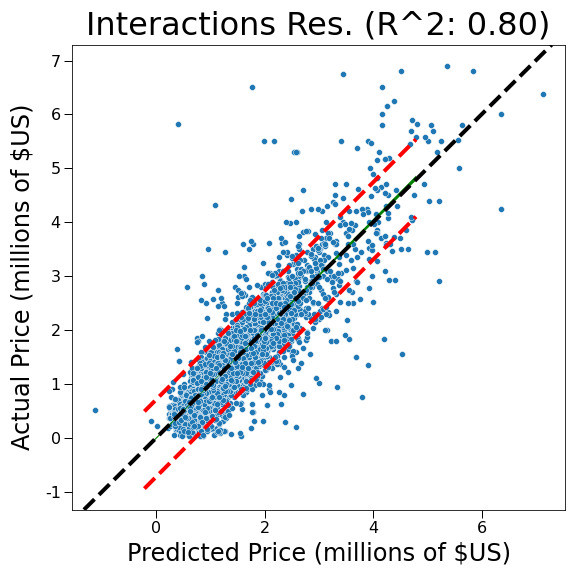

# King County Housing Analysis

**Author**: Joshua Gottlieb

## Overview and Business Problem

Using a subset of housing data from [King County Department of Assessments](https://info.kingcounty.gov/assessor/DataDownload/default.aspx), the goal was to define a business problem that could be solved through statistical analysis and linear regression modeling.

The business scenario chosen is as follows:
Suppose you are a real estate developer in King County, and you want to build and sell a house and need to know which features to include to maximize sales price. Similarly, if you buy a house to remodel, what renovations should you focus on in order to appreciate the value of the house?

Basic descriptive analysis can help identify which features are present in houses that are currently selling well. In order to quantify how much a feature adds to the sales price of a house and predict housing prices, it will be necessary to use modeling techniques. Linear regression, in particular, is useful for solving this business problem because it allows us to get concrete answers for the effect of features through coefficient values as well as predict the margins of error in our model.

## Data Exploration, Cleaning, and Feature Engineering

A description of column names can be found [here](./data/raw/column_names.md).

Some houses appear multiple times in our data. In order to simplify exploration and to resolve record conflicts, only the latest data for each house was kept, as based off of the `date` column, and in the case of multiple records on the same date, the record with the highest `id` value was kept. Zip codes were extracted from the `address` column. The `yr_renovated` column was dropped from our data due ~95% of entries containing a year renovated of 0 - it was unclear if this meant that the house had never been renovated or if the values were simply missing.

The `bathrooms` column contained entries between 0 and 10.5, with very few entries below 1 or higher than 6. The `bedrooms` column contained entries between 0 and 13, with few entries lower than 1 or higher than 7, and the `floors` column contained entries between 1 and 4, with few entries higher than 3. The decision was made to modify these categories in order to model based on sub-samples of sufficient size. The modified values were as follows:

<ul>
    <li> Bathrooms: 1-6</li>
    <li> Bedrooms: 1-7</li>
    <li> Floors: 1-3</li>
</ul>

The `grade` column ranges from 1-13, but values 1-2 refer to specific small sizes of house, while value 13 refers to houses classified specifically as mansions. Thus, it was decided to squash the groups down to 1-10 with average being placed in the middle. `waterfront`, `greenbelt`, and `nuisance` columns could all be encoded as binary values (0 = No, 1 = Yes). `sewer_system`, `heat_source`, and `zipcode` were one-hot encoded, while `view`, `condition`, and `grade` were encoded both ordinally and with one-hot encoding separately. For further information, see the [notebooks](./notebooks).


The distributions of some of the continuous variables in the set are highly skewed. Log-transformations help redistribute these variables to make them more normal which may be useful during regression analysis. All square footage variables were kept as their nominal values, as well as log-transformed (ex: `sqft_living` and `log(sqft_living)`), as well as `price`. 


There are some large outliers in terms of `price` in our data set - very few houses sold for above $10,000,000, but this skews our mean price data. In theory, these houses are custom-made and are not good representations of an average property, instead being owned by the ultra-rich. Thus, houses with a `price` greater than 3 times the standard boxplot maximum value (1.5 * IQR + 75th quantile) were dropped from our data set. Records with `sqft_living` or `sqft_lot` above 3 times the standard boxplot maximum value were dropped for similar reasons. While this does mean that our model loses information about expensive houses with large square footage, this should allow us to focus on homes in a more reasonable range of parameter values that can be reproduced. 


While not all of our columns are represented in this correlation table, it can be seen that there is decently high correlation between `price` and `sqft_living`. This is understandable, as larger houses tend to sell for higher prices. `sqft_living` and `sqft_above` have very high correlation, and it seems reasonable that they may be interrelated. Interrelation between independent variables can lead to collinearity when modeling, which does not make the model invalid, but it does make interpreting coefficients more difficult.


As can be seen from this graph, `sqft_above` and `sqft_living` have a roughly linear relationship. When modeling, it would be wise to drop one of these features. In our case, `sqft_living` is a more useful feature than `sqft_above`, so we will end up dropping `sqft_above` from our more refined models.


Other correlations that were not captured by the prior correlation table include categorical variables such as `zipcode`. Realistically speaking, location of a property has a large influence on not only the value (`price`) of a property, but also many other features, such as being near water (`waterfront`) or available land space (`sqft_lot`, `sqft_living`). In order to capture these relationships between our independent variables, it is necessary to introduce what are called *interactions*. Specifically, we created a great number of first-degree interactions between our variables, which is where we allow our variables to be multiplied together. For example, to capture the interaction between `sqft_lot` and `bedrooms`, we would create a feature `sqft_lot_x_bedrooms` which consists of the lot square footage multiplied by the number of bedrooms. These interactions can help improve modeling by allowing our model to adjust the strength of one feature in the presence of another feature. For a full account of all of the interactions created for use in modeling, view the [notebooks](./notebooks).


## Results

Baseline Regression Coefficients   |  Baseline Regression Residual Plot
:-------------------------:|:-------------------------:
  |  

The baseline model used 102 independent variables (of which 77 were zip codes which had been one-hot encoded). Of those 102 independent variables, 85 had p-values below 0.05, meaning 85 were statistically significant. The above snapshot shows a small selection of particular variables of interest, with their coefficients and their 95% confidence intervals. The model itself had an R^2 value of 0.75, indicating that 75% of the variance in the data was captured by the model. The red lines indicate the 95% prediction interval region - meaning 95% of the observed values fall within that prediction interval.

The main takeaways from this model are that location is quite important, as places such as Medina (+$2.7 million) or Bellevue (+$1.9 million) have much higher house prices on average compared to the reference location of Kent (the most common zip code in our dataset). Being on the waterfront increases the value of a house by nearly $600,000 on average, while each additional square foot of living area increases price by $171.89 on average. Considering square footage is most frequently measured in the thousands, an extra 1,000 square feet of living space corresponds to an average price increase of ~$171,000. Grade of a house can significantly increase its value, an increase of one in grade produces an average price increase of $106,000. Thus, even an average house (grade 5) can be worth several hundred thousand dollars more than a low grade house (grade 3).

This baseline model used all of the main features present in our data, with no columns dropped to account for multicollinearity, as discussed earlier.

<p align = 'center'> </p>

The final model used most of the main features in our data, but only the primary square footage measurements `sqft_living` and `sqft_lot`. In addition, it incorporated a great many interaction features to account for how variables such as zip code and square footage might empower or disempower one another. This model utilized 626 variables in total, of which 528 were interaction variables. For a full list of which interactions were included, see the [notebooks](./notebooks).

The R^2 value of this model is 0.8, a marked increase over the baseline model. As before, the red lines indicate the 95% prediction interval region. This model captures more data than the baseline, and the residuals of the uncaptured points appear to be relatively uniformly distributed above and below the line of prediction, which is a good sign that our model has not drastically violated any of the assumptions required for linear regression.

Unlike the baseline model, it is difficult to extract meaningful coefficients from this model. To understand why, consider the following graphs.

Multiple Linear Regression Without Interactions   |  Multiple Linear Regression With Interactions
:-------------------------:|:-------------------------:
 | 
| [Stack Exchange](https://stats.stackexchange.com/questions/73320/how-to-visualize-a-fitted-multiple-regression-model) | [Penn State Lecture Notes](https://online.stat.psu.edu/stat501/book/export/html/947) |

Neither of these are graphs of our models.

On the left is a graph of multiple linear regression without interactions, as represented by our baseline model. The effect produced by a change in one parameter can be easily estimated by moving down the plane along the correct axis, and since the plane is uniformly increasing or decreasing along that axis, the impact of changing one parameter is clear.

On the right is a graph of multiple linear regression with interactions, as represented by our final model. A change in one parameter is now dependent upon any other variables where interactions are present - the shape our model is no longer flat and uniform, so estimating the effect of a change in any particular parameter becomes messy and difficult.

So, how can we use our model with interactions? This model is still useful, because given a set of input parameters (square footage, zip code, etc.), our model will give us a prediction for the sales price of that house. This can be used to compare prospective projects or upgrades, by inputting different sets of values, it is possible to compare the predicted sales prices. This model can also be used to estimate the value of houses currently on the market. By plugging in a house currently on the market, this model allows us to see if the market price is over or under the predicted sales price, allowing real estate developers to figure out which houses are over- or undervalued.

## Conclusions

Housing prices are always going to be volatile and have variance, but through linear regression, it is possible to estimate the sales price of a house just from knowing its features. Our baseline model can give insights into the most impactful of these features, while our final model can be used to more accurately predict sales prices between houses in a plug and check fashion.

Without a doubt, the most impactful feature of a house is its location. Choosing a zip code such as Medina (98039) versus Auburn (98092) can result in an average difference of price in the millions. When looking to maximize the value of newly built houses, it is best to choose a good zip code with higher average prices. Although related to location, building or renovating a property near the waterfront adds a lot of value to a house, regardless of size or other factors. Being near a waterfront provides an average increase in price of $600,000. The grade of a house can provide a large boost in price, with each point of grade adding $106,000 on average. It is worth noting that the highest grades are only possible with larger square footage and custom design and finish work, so there may be diminishing returns on trying to maximize grade from a building and renovating perspective. Finally, bigger houses have more value - every 1,000 square feet of living space added to a home increases its value by $171,000 on average.


## For More Information

Please look at my full analysis in [Jupyter Notebooks](./notebooks) or in my [presentation](./presentation/King_County_Linear_Regression_Presentation.pdf).

For any additional questions, please contact: **Joshua Gottlieb (joshuadavidgottlieb@gmail.com)**

## Repository Structure

```
├── README.md                          <- The top-level README for reviewers of this project   
├── .gitignore                         <- Hidden file specifying which files to ignore
├── data                               <- Folder containing external and code-generated data
│   ├── cleaned                        <- Folder containing cleaned data used by notebooks
│   │   ├── all_features_test.parquet
│   │   ├── all_features_train.parquet
│   │   ├── baseline_regression_coeff_frame.pickle
│   │   ├── baseline_regression_y_pred.pickle
│   │   ├── cleaned_data.parquet
│   │   ├── primary_discrete_interactions_regression_coeff_frame.pickle
│   │   ├── primary_discrete_interactions_y_pred.pickle
│   │   └── removed_test_data.parquet
│   └── raw                            <- Folder containing raw files used by Data-Cleaning notebook
│       ├── column_names.md
│       └── kc_house_data.csv
├── notebooks                          <- Folder containing Jupyter notebooks with project code
│   ├── Data-Cleaning.ipynb
│   ├── EDA-and-Feature-Engineering.ipynb
│   ├── Modeling.ipynb
│   └── Visualizations.ipynb
├── images                             <- Folder containing images generated from code and from external sources
│   ├── baseline_coeff.png
│   ├── baseline_residuals.png
│   ├── correlation_heatmap.png
│   ├── mean_price_by_zipcode.png
│   ├── multiple_linear_regression_no_interactions.jpg
│   ├── multiple_linear_regression_with_interactions.png
│   ├── prim_disc_inter_residuals.png
│   ├── removing_price_outliers.png
│   ├── sqft_above_vs_living.png
│   ├── sqft_living_by_zipcode.png
│   └── sqft_living_norm_vs_log.png
├── presentation                       <- Folder containing PDF of presentation
│   └── King_County_Linear_Regression_Presentation.pdf
```
