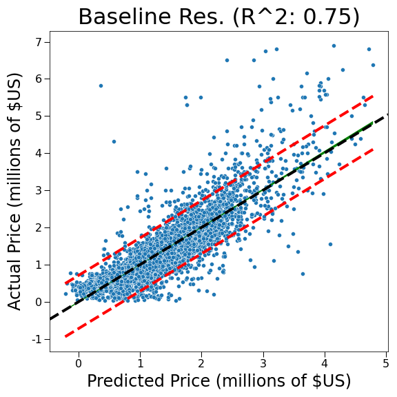

# King County Housing Analysis

**Author**: Joshua Gottlieb

## Overview and Business Problem

Using a subset of housing data from [King County Department of Assessments](https://info.kingcounty.gov/assessor/DataDownload/default.aspx), the goal was to define a business problem that could be solved through statistical analysis and linear regression modeling.

The business scenario chosen is as follows:
Suppose you are a real estate developer in King County, and you want to build and sell a house and need to know which features to include to maximize sales price. Similarly, if you buy a house to remodel, what renovations should you focus on in order to appreciate the value of the house?

Basic descriptive analysis can help identify which features are present in houses that are currently selling well. In order to quantify how much a feature adds to the sales price of a house and predict housing prices, it will be necessary to use modeling techniques. Linear regression, in particular, is useful for solving this business problem because it allows us to get concrete answers for the effect of features through coefficient values as well as predict the margins of error in our model.

## Data Exploration, Cleaning, and Feature Engineering

A description of column names can be found [here](./data/raw/column_names.md).

Some houses appear multiple times in our data. In order to simplify exploration and to resolve record conflicts, only the latest data for each house was kept, as based off of the `date` column, and in the case of multiple records on the same date, the record with the highest `id` value was kept. Zip codes were extracted from the `address` column. The `yr_renovated` column was dropped from our data due ~95% of entries containing a year renovated of 0 - it was unclear if this meant that the house had never been renovated or if the values were simply missing.

The `bathrooms` column contained entries between 0 and 10.5, with very few entries below 1 or higher than 6. The `bedrooms` column contained entries between 0 and 13, with few entries lower than 1 or higher than 7, and the `floors` column contained entries between 1 and 4, with few entries higher than 3. The decision was made to modify these categories in order to model based on sub-samples of sufficient size. The modified values were as follows:

<ul>
    <li>`bathrooms`: 1-6</li>
    <li>`bedrooms`: 1-7</li>
    <li>`floors`: 1-3</li>
</ul>

The `grade` column ranges from 1-13, but values 1-2 refer to specific small sizes of house, while value 13 refers to houses classified specifically as mansions. Thus, it was decided to squash the groups down to 1-10 with average being placed in the middle. `waterfront`, `greenbelt`, and `nuisance` columns could all be encoded as binary values (0 = No, 1 = Yes). `sewer_system`, `heat_source`, and `zipcode` were one-hot encoded, while `view`, `condition`, and `grade` were encoded both ordinally and with one-hot encoding separately. For further information, see the [Notebooks](./notebooks).


(Show square footage normal vs. log)

The distributions of some of the continuous variables in the set are highly skewed. Log-transformations help redistribute these variables to make them more normal which may be useful during regression analysis. All square footage variables were kept as their nominal values, as well as log-transformed (ex: `sqft_living` and `log(sqft_living)`), as well as `price`. 

(Show training price boxplot vs. cleaned training price boxplot)

There are some large outliers in terms of `price` in our data set - very few houses sold for above $10,000,000, but this skews our mean price data. In theory, these houses are custom-made and are not good representations of an average property, instead being owned by the ultra-rich. Thus, houses with a `price` greater than 3 times the standard boxplot maximum value (1.5 * IQR + 75th quantile) were dropped from our data set. Records with `sqft_living` or `sqft_lot` for similar reasons. While this does mean that our model loses information about expensive houses with large square footage, this should allow us to focus on homes in a more reasonable range of parameter values that can be reproduced. 

(Show correlation tables)

While not all of our columns are represented in this correlation table, it can be seen that there is decently high correlation between `price` and `sqft_living`. This is understandable, as larger houses tend to sell for higher prices. `sqft_living` and `sqft_above` have very high correlation, and it seems reasonable that they may be interrelated. Interrelation between independent variables can lead to collinearity when modeling, which does not make the model invalid, but it does make interpreting coefficients more difficult.

(Show correlation graph between sqft_above and sqft_living)

As can be seen from this graph, `sqft_above` and `sqft_living` have a roughly linear relationship. When modeling, it would be wise to drop one of these features. In our case, `sqft_living` is a more useful feature than `sqft_above`, so we will end up dropping `sqft_above` from our more refined models.


Other correlations that were not captured by the prior correlation table include categorical variables such as `zipcode`. Realistically speaking, location of a property has a large influence on not only the value (`price`) of a property, but also many other features, such as being near water (`waterfront`) or available land space (`sqft_lot`, `sqft_living`). In order to capture these relationships between our independent variables, it is necessary to introduce what are called *interactions*. Specifically, we created a great number of first-degree interactions between our variables, which is where we allow our variables to be multiplied together. For example, to capture the interaction between `sqft_lot` and `bedrooms`, we would create a feature `sqft_lot_x_bedrooms` which consists of the lot square footage multiplied by the number of bedrooms. These interactions can help improve modeling by allowing our model to adjust the strength of one feature in the presence of another feature. For a full account of all of the interactions created for use in modeling, view the [notebooks](./notebooks).


## Results

Baseline Regression Coefficients   |  Baseline Regression Residual Plot
:-------------------------:|:-------------------------:
  |  


## Conclusions


## For More Information

Please look at my full analysis in [Jupyter Notebooks](./notebooks) or in my [presentation](./Movie_Presentation.pdf).

For any additional questions, please contact: **Joshua Gottlieb (joshuadavidgottlieb@gmail.com)**

## Repository Structure

```
├── README.md                          <- The top-level README for reviewers of this project
├── Movie_Presentation.pdf             <- PDF version of project presentation
├── .gitignore                         <- Hidden file specifying which files to ignore
├── notebooks                          <- Folder housing Jupyter notebooks with project code
│   ├── EDA.ipynb                      
│   ├── Merging_and_Cleaning.ipynb     
│   └── Visualization.ipynb            
├── data                               <- Folder containing external and code-generated data
│   ├── cleaned                        <- Folder containing cleaned data used by EDA and Visualization notebooks
│   │   └── merged_data.parquet              
│   ├── raw                            <- Folder containing raw files used by Merging notebook
│   │   ├── bom.movie_gross.csv              
│   │   ├── im.db                            
│   │   ├── rt.movie_info.tsv                
│   │   ├── rt.reviews.tsv                   
│   │   ├── tmdb.movies.csv                  
│   │   ├── tn.movie_budgets.csv             
│   │   └── unzip.py                   <- Python script to transform zipped data into raw data
│   └── zipped                         <- Folder containing zipped data
│       ├── bom.movie_gross.csv.gz
│       ├── im.db.zip
│       ├── rt.movie_info.tsv.gz
│       ├── rt.reviews.tsv.gz
│       ├── tmdb.movies.csv.gz
│       └── tn.movie_budgets.csv.gz
└── images                             <- Folder containing images generated from code
│   ├── change_in_roi_by_genre.png
│   ├── distribution_of_roi_by_genre.png
│   ├── median_roi_by_genre.png
│   ├── runtime_and_roi.png
│   ├── top_directors_by_genre.png
│   └── top_writers_by_genre.png

```